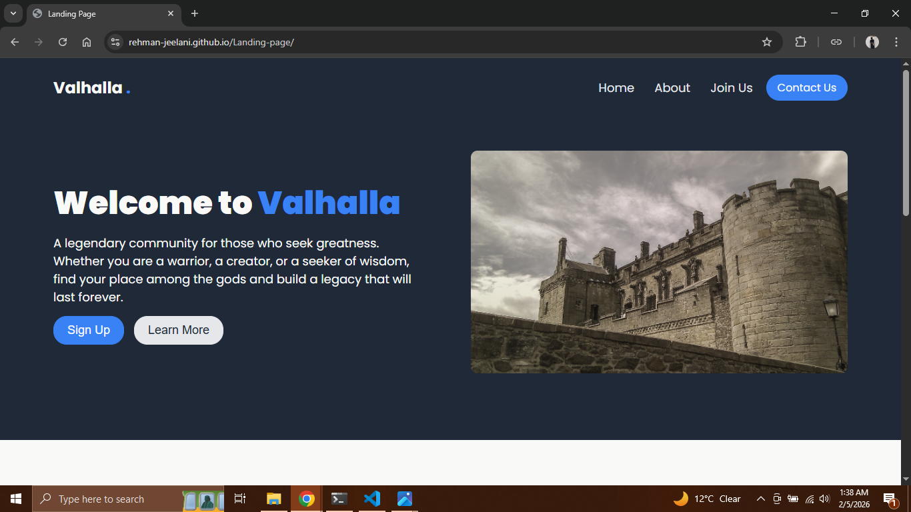

# Valhalla Landing Page

A responsive landing page themed around Norse Mythology, built as part of [The Odin Project](https://www.theodinproject.com) curriculum. The goal was to create a landing page using semantic HTML and modern CSS.

## 🔗 Live Demo
[**View the Live Demo**](https://rehman-jeelani.github.io/Landing-page/)

## 📸 Preview

## 🛠️ Built With
* **HTML5** - Semantic structure (header, nav, section, footer).
* **CSS3** - Flexbox for main layouts and alignment.
* **Google Fonts** - *Poppins*, *Montserrat*, and *Roboto* for typography.
* **Responsive Design** - Media queries to ensure the layout adapts to mobile screens (max-width: 768px).

## 🧠 Key Learnings
* **Responsive Layouts:** Implemented a `@media` query to switch the navbar and main sections from `flex-row` to `flex-column` on smaller devices.
* **Flexbox Mastery:** Used `justify-content: space-between` and `align-items: center` to manage the navigation bar and hero section spacing.
* **Interactive Elements:** Added CSS `:hover` states to buttons and cards (including a scale transform effect on the Champion cards) to improve user experience.
* **Theming:** Practiced consistent styling (colors like `#3882f6` and `#1f2937`) to maintain the "Norse" aesthetic throughout the page.

## 📜 Credits
* **Design:** The Odin Project (Foundation Course).
* **Theme:** Norse Mythology / Valhalla.
* **Images:** Character assets (Odin, Thor, Loki) and icons used for the visual design.

---
*Created by Rehman Jeelani*